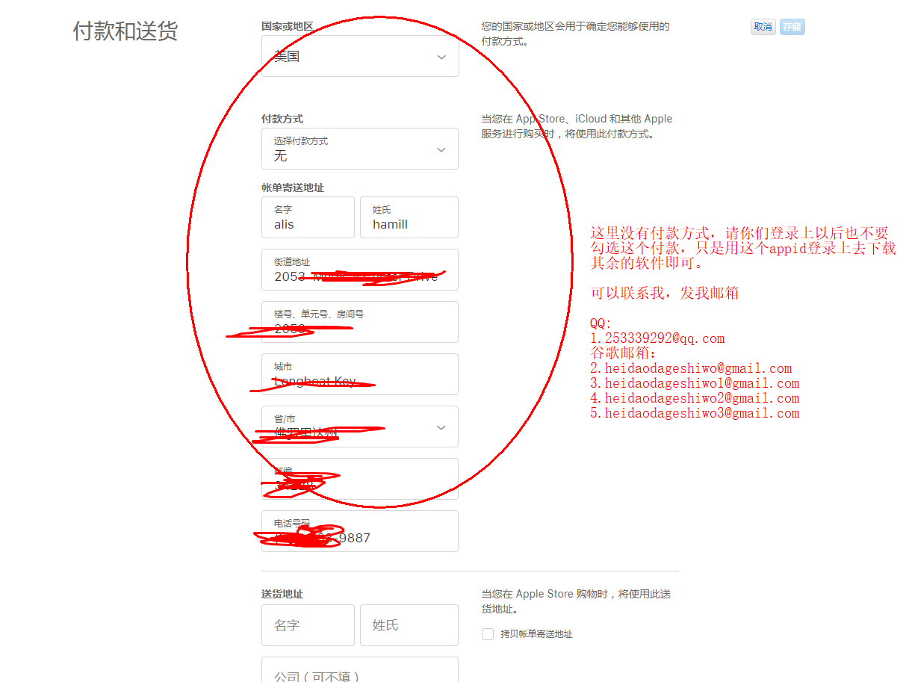
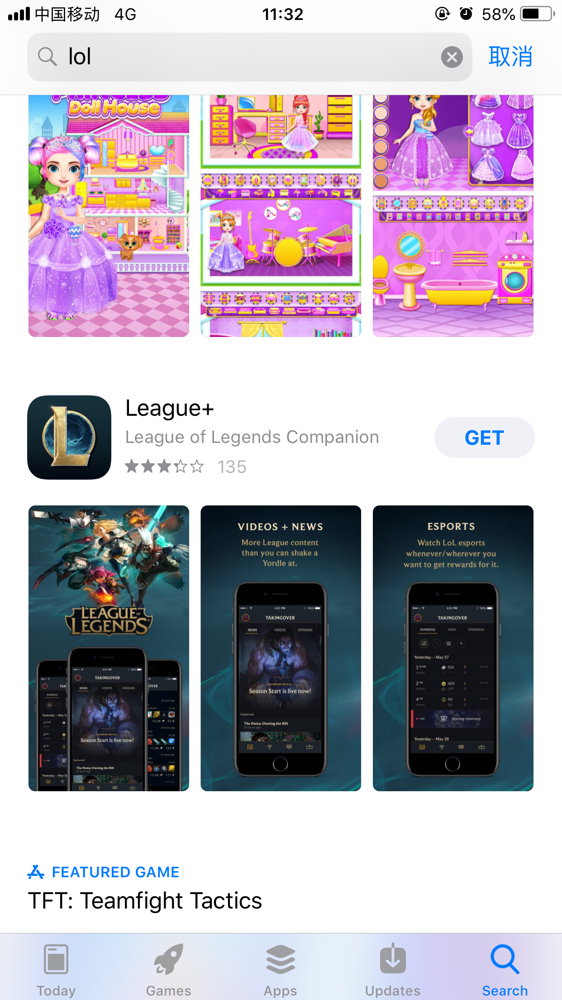
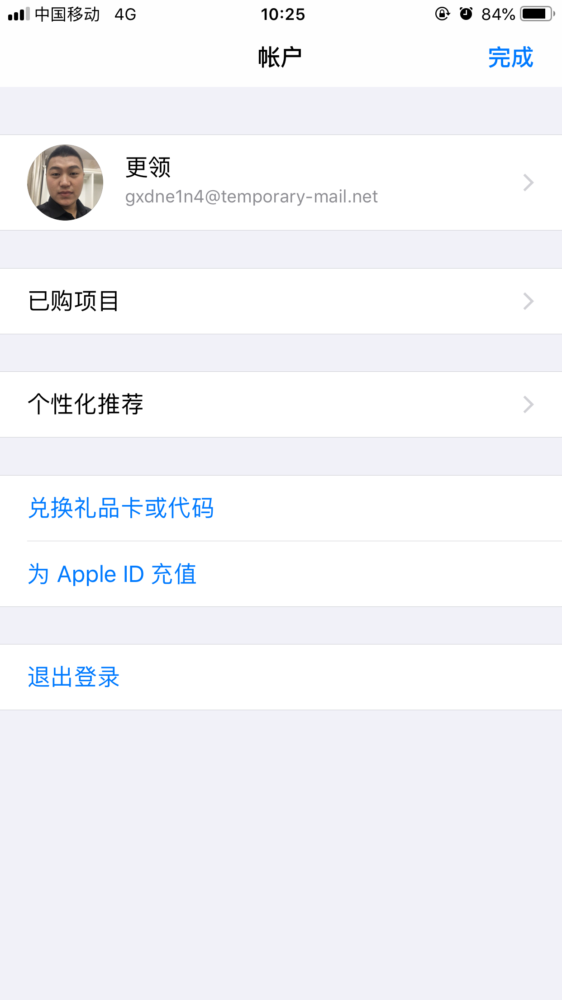

# APPID
githubAPPID展示

# 此ID为批量注册的美区苹果APPID，，没有实名，所以不要用此ID用于激活新买的手机用。
## 出售的苹果账号是一人一号、卖一删一.
### ID质保一年的时间，若超过一年之后，出现任何问题不再售后！
# 如果还有其它疑问，请联系微信：18764489731
# QQ邮箱：253339292@qq.com 
# 谷歌邮箱： heidaodageshiwo@gmail.com

微信二维码：

## 11月新增账号：
### 1.4n7urk4v@temporary-mail.net
### 2.h427e177@temporary-mail.net
### 3.ffja6qpz@temporary-mail.net
### 4.3j3yefta@temporary-mail.net
### 5.5gz17_kc@temporary-mail.net
### 6.rmdgaur4@temporary-mail.net
### 7.xdwkkg33@temporary-mail.net
### 8.rqkciy8c@temporary-mail.net
### 9.qjzzeugm@temporary-mail.net(已售)
### 10.jx8hqqo3@temporary-mail.net(已售)
### 11.y7cu4jx2@temporary-mail.net(已售)

# 美区苹果id截图：登录美区id以后，App Store展示的都是英文，可以下载美区的软件

# 有需要访问谷歌，谷歌邮箱，youtube，Twitter,Facebook,或者是想看小电影的的朋友请联系我，包教包会

